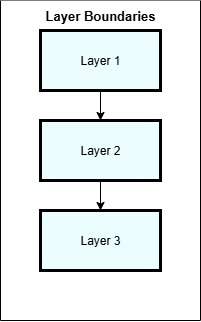
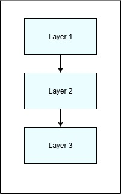

# What Is a Layer

A layer is a zone of responsibility within an architectural system, defined not by technology, framework, or project structure, but by the kind of responsibility it owns and the limits placed on how it may interact with the rest of the system. Layers exist to group related responsibilities so they can change together, while making it explicit where those responsibilities stop and others begin. When layers are well defined, they give structure to architectural boundaries and make intent visible in the shape of the system itself. When they are treated casually, layers lose that meaning and become little more than labels applied after the fact, describing organization without actually constraining behavior.

  

Layers exist before code is written and should remain stable as implementation details change. They do not shift because a framework is introduced, a technology is replaced, or a project is reorganized. Implementation should conform to layers, not redefine them. When layers are inferred from existing code rather than defined deliberately, architecture becomes descriptive instead of intentional.

---

## Layers Make Boundaries Concrete

Boundaries are conceptual by nature. They describe separation, but they do not, by themselves, dictate structure. Layers give boundaries a concrete presence in the system by defining an inside and an outside, establishing where interaction is permitted, and making violations easier to detect. This is where boundaries stop being theoretical and start becoming operational.

  

---

## Layers Introduce Direction

Layers are not peers. A layered architecture introduces direction into the system by defining how interaction is allowed to flow. That direction determines which layers may depend on others, where decisions are permitted, and which parts of the system are expected to absorb change over time. Without direction, separation becomes superficial. Components may appear organized, but responsibility remains negotiable and dependencies form wherever it is most convenient.

A system can be organized into layers that represent distinct zones of responsibility without yet imposing architectural constraint. In that state, layers describe structure, but they do not restrict behavior. Responsibility may be visually separated while still remaining freely accessible.

  

With direction in place, layers begin to impose rules. Dependency is constrained, responsibility becomes fixed, and change is expected to flow in predictable ways. This is what transforms layers from organization into architecture.

---

## Architectural Reasoning Order

Architects should reason about layers in the following order:

responsibility → constraint → enforcement

When this order is reversed, layers become rules without purpose. When it is followed, layers become an intentional system that can be explained, defended, and enforced over time.

---

  <a href="./README.md">◀ Chapter Overview</a>
  &nbsp;|&nbsp;
  <a href="./02-what-a-layer-is-not.md">What a Layer Is Not ▶</a>

