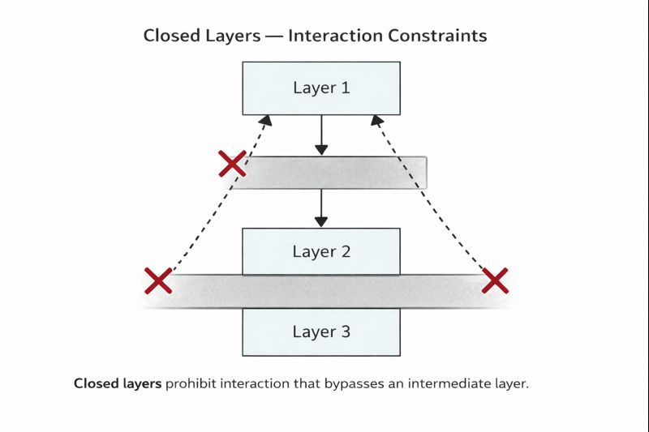

# What Closed Layers Are

A closed layer is a layer whose boundaries are not optional. Interaction with that layer is restricted to specific, intentional entry points, and all other access paths are disallowed by architectural rule. Closure is not a characteristic of the layer’s responsibility itself, but of how that responsibility is protected from arbitrary access.

Closed layers exist to ensure that architectural intent survives pressure. When layers are open by default, responsibility and direction rely on discipline and shared understanding. When layers are closed, those expectations are encoded into the structure of the system, making violations explicit rather than accidental.

---

## Closed Layers Enforce Direction

In a closed layered architecture, dependency direction is not merely suggested. It is enforced. Higher layers may depend on lower layers only through defined paths, and lower layers are insulated from knowledge of higher ones. This restriction prevents backflow of responsibility and ensures that decisions accumulate where they are intended to live.

Without closure, direction erodes through convenience. With closure, direction becomes a property of the architecture itself.

  

---

## Closed Layers Protect Responsibility

Closing a layer protects the responsibilities it owns by limiting who may interact with them and how. Logic cannot drift into a closed layer without passing through the architectural paths designed to handle it. This makes responsibility visible, reviewable, and defensible over time.

Closed layers do not reduce flexibility. They reduce ambiguity. By constraining how responsibilities are accessed, they preserve the integrity of those responsibilities even as the system evolves.

---

## Closed Layers Make Violations Observable

One of the most important effects of closure is that architectural violations become detectable. When layers are open, misuse blends into normal development activity. When layers are closed, improper access stands out as a structural problem that must be addressed explicitly.

This visibility changes behavior. Architects and teams can reason about architecture based on what the system allows, not just what it encourages.

---

## Closed Layers Are a Structural Choice

Closing layers is a deliberate architectural decision. It signals that certain boundaries are non-negotiable and that preserving system shape matters more than local convenience. This choice trades ease of access for long-term clarity and stability.

Closed layers are not a technical trick. They are an architectural commitment.

---

  <a href="./README.md">◀ Chapter Overview</a>
  &nbsp;|&nbsp;
  <a href="./02-what-closed-layers-are-not.md">What Closed Layers Are Not ▶</a>

