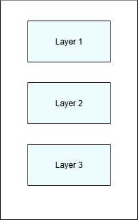

# What Architectural Layers Are

Architectural layers are deliberate, conceptual partitions of responsibility that define how a system is structured and reasoned about. A layer represents a distinct category of concerns within the architecture and establishes where certain kinds of decisions are allowed to exist. Layers exist to impose order on complexity by ensuring that responsibilities are grouped intentionally rather than mixed opportunistically.

A layer is an architectural unit defined by responsibility and authority. It answers the question of what kind of work belongs here and, just as importantly, what kind of work does not. When an architect defines a layer, they are not describing how the system is built, but how it is meant to be understood and governed. This distinction is critical, because architecture operates at the level of intent, not construction.

Layers exist to control cognitive load. In a system without layers, every part of the system can potentially interact with every other part. This creates an explosion of possible relationships that no individual can reasonably hold in their head. Layers reduce this complexity by constraining where responsibilities live and how they are conceptually separated. This allows architects and engineers to reason about one part of the system without constantly accounting for all others.

Architectural layers also create stability by isolating change. Not all concerns in a system change for the same reasons or at the same rate. By grouping responsibilities with similar rates of change, layers prevent volatility in one area from rippling unnecessarily through the system. This isolation is not accidental. It is the result of deliberate architectural grouping based on responsibility rather than convenience.

Layers are not defined by the flow of execution. While execution may pass through multiple layers, that flow is not what makes the layers meaningful. What matters is the separation of responsibility and the limits placed on where decisions are allowed to occur. Confusing layers with execution flow leads to architectures that appear structured but fail to enforce meaningful separation.

Importantly, architectural layers are independent of physical structure. They are not folders, projects, assemblies, or deployment units. Those elements may reflect layers, but they do not define them. A layer exists only when its responsibilities are explicitly understood and consistently respected. Without that shared understanding, the appearance of layers is cosmetic rather than architectural.

The number of layers in a system is not a measure of architectural quality. Too few layers can result in blurred responsibility and uncontrolled coupling. Too many layers can introduce unnecessary indirection and confusion. The effectiveness of layers is determined by the clarity of their responsibilities and the discipline with which those responsibilities are maintained over time.

When used correctly, layers provide the foundational structure upon which all other architectural constraints are built. Boundaries, dependency direction, contracts, and governance all assume the existence of clear layers. Without layers, those concepts have no stable footing. Layers are therefore not optional abstractions. They are the starting point for architectural reasoning in any nontrivial system.

  

---

  <a href="../table-of-contents.md">◀ Table of Contents</a>
  &nbsp;|&nbsp;
  <a href="../chapter-02-architectural-layers/02-what-architectural-layers-are-not.md">
    Chapter 2.2: What Architectural Layers Are Not ▶
  </a>

