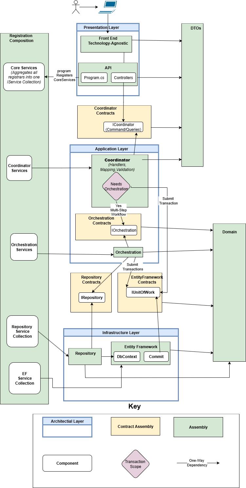

# Part 2 — Summary

This part transformed the architectural concepts introduced in Part 1 into a complete application architecture.

Rather than presenting individual patterns or technologies, it demonstrated how architectural responsibilities can be organized into a cohesive system whose structure reinforces the design decisions behind it.

Throughout this part, every major architectural responsibility was introduced independently.

Construction, request entry, request coordination, workflow coordination, persistence, data representation, system exposure, and architectural enforcement were each assigned a clear owner with well-defined responsibilities and protected architectural boundaries.

Together, these architectural units form a complete execution model.

More importantly, they demonstrate a broader architectural philosophy.

- Every significant responsibility has a single owner.
- Every architectural boundary exists to protect a responsibility.
- The physical structure of the solution enforces those boundaries so that the correct architectural decision becomes the natural path rather than relying on developer discipline.

This is the defining characteristic of the Strutton Technologies Application Architecture.

Its purpose is not simply to organize code.

Its purpose is to preserve clarity, consistency, and maintainability throughout the lifetime of the application, allowing systems to evolve without gradually losing their architectural integrity.

Now that each architectural responsibility has been examined individually, the architecture can be viewed as a complete system.

The diagram above is no longer a collection of individual architectural units. It represents a cohesive execution model where every responsibility has a defined owner, every interaction follows a controlled path, and every architectural boundary exists to protect the long-term integrity of the system.

## What Comes Next

Part 3 moves from architecture to implementation.

The architecture has now been defined.

The next part demonstrates how that architecture is implemented in practice, including solution structure, project organization, dependency registration, and the development patterns used to build applications that remain consistent with the architectural principles established throughout this part.

---

[← Architectural Enforcement](../08-architectural-enforcement/04-long-term-impact.md) |
[Table of Contents](../../04-table-of-contents.md) |
[Continue to Part 3 →](../../part-03-architectural-application-styles/README.md)
